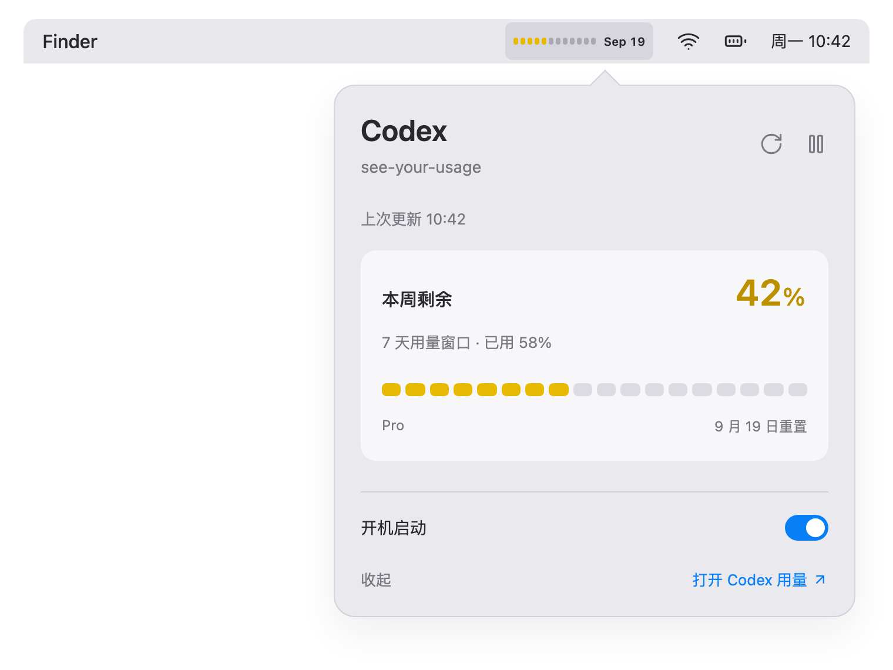
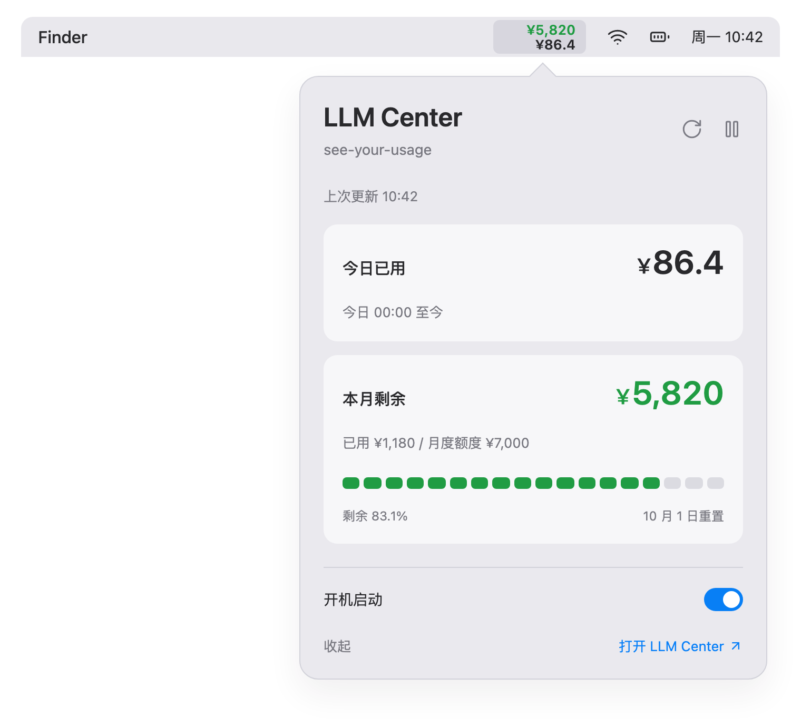

# see-your-usage

A native, low-energy macOS menu bar app for Codex and an optional LLM Center.
The two services are displayed and refreshed independently in one process.

## Preview

Product illustrations with example data and simplified controls.





## Menu bar

- **Codex** keeps its segmented remaining-capacity bars and reset dates. Menu width
  follows the date text, with no window labels or refresh dot. Weekly-only responses
  use one row; full window names remain in the popover.
- **LLM Center** uses two unlabeled rows: personal monthly remaining amount above,
  today's spending below. Width follows the text instead of reserving a wide slot.
- Money uses `¥`: monthly amounts are integers and today's spending has one decimal,
  truncated rather than rounded. Actual zero spending today
  displays `Nah`. Large menu values use `万`; the popover shows the full integer.
- LLM Center monthly remaining amounts below 3,000 turn yellow; below 1,000 turn red.
  At 3,000 the color is green; at 1,000 it is yellow. These are the same system colors
  used by Codex. Codex's percentage thresholds are unchanged.

In the expanded LLM Center popover, today's usage is shown above monthly remaining.

## Independent service settings

Each popover has **启动并在菜单栏显示** and **开机启动此服务** switches.
Hiding a service stops its timers, requests and authorization polling. The other
service continues normally. Login startup preferences are independent; a manual
launch can still display a service whose login startup is off.

Use **服务…** in either popover to restore a hidden service. If both are hidden,
reopen `see-your-usage` from Spotlight or Applications to access these switches.
macOS lists one login item for the app; it runs the services enabled for login.

## LLM Center setup

LLM Center is an optional integration for ModelBest's internal API-key and budget
platform. It requires authorized company-network access. The implementation reads
personal quota data; it does not obtain inference API keys or perform model calls.

In its popover, choose **平台地址…** and enter the HTTPS root URL supplied by your
organization. The hostname is stored only in local app preferences, not in this
repository. An unconfigured installation makes no requests to an internal platform.

On launch, configured instances try saved credentials without opening a browser.
Choose **在 Safari 中登录** when authorization is needed. The app opens the
platform's official browser-authorization page in Safari. During this explicit
login, macOS asks permission to control Safari so the app can open a temporary
background authorization tab later. It does not enable JavaScript from Apple Events or change
Safari preferences. Denying permission still allows a one-time browser login.
No CLI is required. Ordinary network failures show **未更新 / LLM Center** without
a sign-in button.

Credentials are stored in macOS Keychain, separated by platform origin. Existing
access/refresh pairs continue to renew when less than a minute remains, or retry
once after a 401. Rotated credentials are saved before another quota request.
New Safari authorizations use the official device flow, which currently documents
only a `webToken`, not a refresh token. After a 401, a linked session opens a temporary
background tab in an existing Safari window. The official web app redirects through
unified login, which can reuse Safari's SSO session, and completes another device authorization; the native app validates
the resulting token with a quota request. A new token replaces the previous one
only after validation. The latest authorization URL is tracked in Keychain as the
browser connection record; its tab does not need to remain open.

Background recovery requires Safari to be running with an existing window,
automation permission and a usable SSO session. Closing the original authorization
tab is supported. Keeping Safari running alone does not guarantee that SSO remains valid.
Recovery never creates windows, selects a tab, brings Safari forward, or requests
permission in the background. It attempts to close its temporary tab after success,
failure or cancellation, only if exactly one unselected tab still has the unique
authorization URL. Selected, navigated or ambiguous tabs are left alone, including
pages waiting for a new SSO login. Revoking permission or expiry of the SSO session
can require an explicit login. The app never
extracts browser cookies, passwords or refresh tokens. Background authorization
polling has a 45-second deadline, plus any request already in flight (20 seconds
maximum per request); completion, cancellation or failure stops polling.
Outages retain the session and back off. Changing the platform address cancels
existing requests and requires that origin's login. API redirects are rejected,
and authorization URLs must have the same HTTPS origin as the configured platform.
Keychain operations prohibit system authentication prompts. Tokens are cached in
memory; denied keychain access stops retrying. If a new login cannot be persisted,
the app uses it in memory and explains that restart will require another login.
It never loosens keychain permissions or falls back to plaintext token files.

## Energy and freshness

- AppKit; no Electron, embedded browser, telemetry or CLI subprocess. Safari is
  opened only for a user-requested login; the app does not keep a web view running.
- One read-only LLM Center request per refresh, plus token renewal when needed;
  no log scanning or cost estimation.
- One coalescible, one-shot timer per running service: 5 minutes normally,
  10 minutes in Low Power Mode. No high-frequency UI timers or animation loops.
- Popover refreshes are deduplicated and throttled. Failures back off through
  5, 10, 20, 40, then 60 minutes. Manual refresh is throttled to 5 seconds.
- Pause, sleep or disabling the service cancels its work. Missing login/configuration
  stops periodic refresh. Wake schedules a delayed refresh instead of a burst.
- Beijing day/month boundaries invalidate old values when the display updates;
  last known data remains inside the popover with its timestamp and error.
- Interactive login follows the server's expiry, capped at ten minutes. Native
  renewal requests are deduplicated and add no
  periodic timer. An in-flight rotating grant finishes saving its result even if
  the associated quota refresh is cancelled.

## Build and install

Requires macOS 14+ and Xcode Command Line Tools. Apple Silicon and Intel supported.

```sh
./scripts/run.sh
./scripts/build_app.sh
swift test
```

`run.sh` installs to `~/Applications/see-your-usage.app`. For native light/dark
layout snapshots using synthetic test fixtures:

```sh
SEE_USAGE_QA_DIR="$PWD/.build/qa" swift test
```

The README illustrations are drawn in
[HTML/CSS](docs/design/product-previews.html). To regenerate the separate native
UI captures from synthetic state:

```sh
SEE_USAGE_PRODUCT_DIR="$PWD/docs/images" swift test --filter renderProductScreenshots
```

Review [SECURITY.md](SECURITY.md) before publishing diagnostics or screenshots.

## License

MIT
